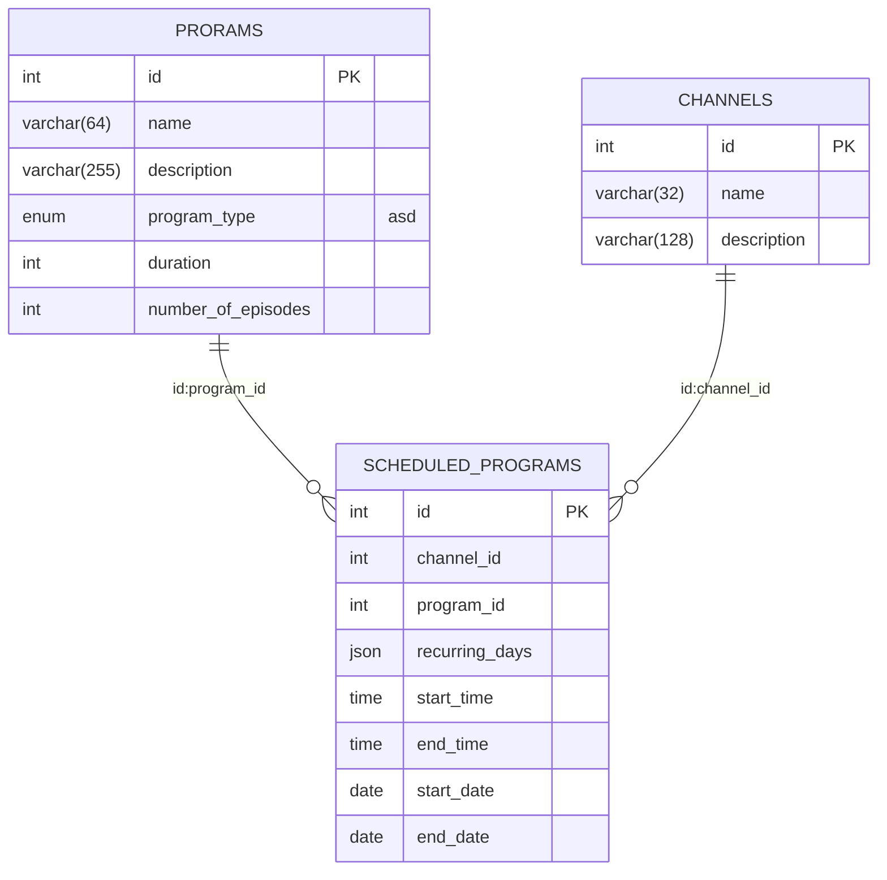

# TV Schedule application
### App for scheduling TV programs for channels.

## Information
- App is written in Java 17 using Spring Boot
- MySQL database is used which is running in docker container
- Data is saved to DB after the program is closed and run again, until db docker container and volume is removed locally. 

## Running the app
- Clone the repository
- !! **Docker** must be running !!
- Build the app `./gradlew build`
- Run the application ```./gradlew bootRun```
- ...or ```java -jar build/libs/tvApp-0.0.1-SNAPSHOT.jar```
- !! _If running the application fails with `Communications link failure` error,
it means that MySql container is not yet running. Wait few second and try again. 
(TODO: Wait for MySql container to be healthy and running before running the app)_

## Swagger API docs
### Available when running app locally
- http://localhost:8080/api-docs

## Structure



## TODO:
### Thing to be added/improved:
- Check for program end times - if is past midnight, program should be scheduled for two days
- Add more validation for adding new programs to schedule
- Calculate correct end date for programs with concrete number of episodes and scheduled for only some days a week
